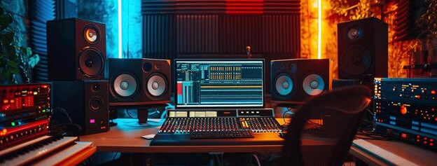

<h1 align="center">
  
</h1>


---

# Music Studio — Download · Identify · Complete

## Aperçu
Notebook **Google Colab** tout-en-un qui transforme un court extrait audio en un morceau complet. À partir de l'URL d'un **Reel Instagram** ou d'un **Short YouTube**, l'outil télécharge l'audio, **identifie** le titre exact (AudD.io) et le genre musical (modèles HuggingFace), récupère les **paroles** (Lyrics.ovh), puis **complète automatiquement** l'extrait en une piste de **2min30** grâce à **MusicGen** (Meta). Le tout est piloté depuis une interface graphique unifiée dans une seule cellule Colab. Aucune configuration manuelle de code n'est nécessaire.

## Fonctionnalités

### ① Téléchargement (Instagram / YouTube)
- Téléchargement de l'audio depuis **Instagram Reels** et **YouTube Shorts / vidéos** via `yt-dlp`
- Trois formats au choix : **MP3** (320 kbps), **WAV** (qualité brute) ou **MP4** (vidéo + audio fusionnés)
- **Import local** : possibilité de charger un fichier déjà présent sur l'ordinateur au lieu de télécharger
- Support optionnel d'un fichier `cookies.txt` pour accéder aux **Reels privés**
- Lecteur audio intégré et téléchargement automatique du fichier obtenu
- Les fichiers sont rangés dans `./downloads` et exposés aux étapes suivantes

### ② Identification (AudD.io + HuggingFace)
- **Titre exact** via l'API **AudD.io** : renvoie titre, artiste, album, date de sortie et liens **Spotify** / **Apple Music**
  - Clé API optionnelle (gratuite sur [dashboard.audd.io](https://dashboard.audd.io)) — sans clé, seuls les genres sont détectés
- **Genre musical** analysé en parallèle par **2 modèles HuggingFace** :
  - **CLAP** (`laion/clap-htsat-unfused`) — classification *zero-shot* audio↔texte sur 20 styles (pop, hip hop, electronic, techno, trap, lo-fi, afrobeats, drill…)
  - **AST** (`MIT/ast-finetuned-audioset-10-10-0.4593`) — *Audio Spectrogram Transformer* entraîné sur AudioSet (527 classes)
- L'audio est ramené en **mono 16 kHz** et tronqué aux **30 premières secondes** pour l'analyse
- Affichage des **5 meilleurs résultats** par modèle avec scores et barres de confiance
- Barre de progression étape par étape (titre puis chaque modèle)

### ③ Paroles (Lyrics.ovh)
- Récupération des **paroles** du morceau via l'API **[Lyrics.ovh](https://lyrics.ovh)** — **gratuite, sans clé**
- Artiste et titre **réutilisés** depuis l'identification ② (clé AudD requise) ou **saisis / corrigés à la main**
- Paroles affichées directement dans l'interface (zone défilante), avec repli clair si le titre n'est pas dans la base
- Étape **optionnelle** : elle n'altère ni l'audio ni la complétion qui suit

### ④ Complétion musicale (→ 2min30)
- Génération des parties manquantes par **MusicGen** (`facebook/musicgen-small`, Meta)
- L'extrait original est conservé au centre ; le modèle compose une **intro (≈45 %)** et une **outro (≈55 %)** pour atteindre la cible de **150 s (2min30)**
- Génération **par chunks de 20 s** enchaînés, chaque chunk servant de contexte au suivant
- Assemblage final `intro + extrait + outro` exporté en **WAV** dans `./generated/completed_music.wav`
- Détection automatique du **GPU** (CUDA) avec repli sur CPU et avertissement
- Lecteur audio intégré et téléchargement direct du résultat

### ⑤ Interface graphique unifiée
- UI complète construite avec **ipywidgets**, regroupée dans **une seule cellule** Colab
- Quatre sections guidées (Télécharger · Identifier · Paroles · Compléter) reliées entre elles
- Menus déroulants synchronisés : un fichier téléchargé apparaît automatiquement dans les étapes de génération
- Barres de progression, messages d'état colorés (info / succès / erreur) et lecteurs audio en ligne

## Technologies
- **Python** + **Google Colab**
- **yt-dlp** — extraction audio/vidéo Instagram & YouTube
- **HuggingFace Transformers** — MusicGen Small, CLAP, AST
- **PyTorch** / **torchaudio** — chargement et rééchantillonnage audio
- **AudD.io API** — reconnaissance du titre
- **Lyrics.ovh** — récupération des paroles (gratuit, sans clé)
- **scipy** — export WAV
- **ipywidgets** + **IPython.display** — interface graphique
- **FFmpeg** (via yt-dlp) — conversion des formats audio

## Installation

**Aucune installation locale nécessaire.** Le projet est conçu pour **Google Colab** :

1. Ouvre `music_studio.ipynb` dans Google Colab
2. (Recommandé) Active un GPU : **Exécution → Modifier le type d'exécution → GPU T4**
3. Exécute les cellules dans l'ordre — les dépendances (`yt-dlp`, `transformers`, `torch`, `ipywidgets`…) s'installent automatiquement
4. Utilise l'interface graphique affichée par la **Partie 4**

## Structure du projet
```
Music-Studio/
  music_studio.ipynb   → Notebook Colab complet (4 parties)
  music_studio.py      → Version script exportée du notebook
  README.md            → Ce fichier
  assets/
    images/github/     → Images du README (header, star, UI)
  downloads/           → Audios téléchargés / importés (créé à l'exécution)
  generated/           → Pistes complétées en 2min30 (créé à l'exécution)
```

## Pipeline en bref
```
URL Reel / Short
      │
      ▼
①  yt-dlp ──▶ ./downloads/*.mp3 | *.wav | *.mp4
      │
      ▼
②  AudD.io (titre)  +  CLAP & AST (genre)
      │
      ▼
③  Lyrics.ovh ──▶ paroles affichées dans l'UI  (optionnel)
      │
      ▼
④  MusicGen ──▶ intro 45% + extrait + outro 55%  (chunks 20s)
      │
      ▼
   ./generated/completed_music.wav   (≈ 2min30)
```

## Aperçu de l'interface


## Auteur
- [Pierre-Portfolio](https://github.com/Pierre-Portfolio/)

---

<p align="center">Projet réalisé en 2026.</p>
